# (IV 2023) LVT2Calib: Automatic and Unified Extrinsic Calibration Toolbox for Different 3D LiDAR, Visual Camera and Thermal Camera
Note: If you have any problems in running the code, please raise up in the **"Issues"** (English is preferred), so that the solutions to same problems can be seen by others. It is **NOT** recommended to send private emails.


## Introduction

This solution provides an automatic and unified method for extrinsic calibration between repetitive scanning and non-repetitive scanning 3D LiDAR, sparse and dense 3D LiDAR, visual and thermal camera.

A four-circular-holes board is adopted for all sensors as the calibration board. The four circle canters can be detected by all sensors, which are ideal common features. To unify the calibration process, we propose an automatic target detection method based on template matching. In addition, we provide two types of output, minimizing 2D re-projection error (Min2D) and minimizing 3D matching error (Min3D), for different users of LiDAR-Camera suite.

## How to use

### Note

For usage on **Robosense repetitive-scan LiDARs**, please use [rs_to_velodyne](https://github.com/HViktorTsoi/rs_to_velodyne) to transfer Robosense-format Point Cloud to Velodyne-format Point Cloud at first. Then use the **velodyne-related settings** to do the calibration.

The specialized luanch for robosense serials is under development...

### Step1: Environment Configuration

#### 1.1 Install environment and driver

Install the ROS  environment and install the SDK and driver of the LiDAR you use. You can skip this step if they are already installed. 

Update: using docker

#### 1.2 Denpendency

Tested with Ubuntu 20.04 64-bit. ([Another branch for Ubuntu 18.04/16.04](https://github.com/Clothooo/lvt2calib/tree/ros_melodic))

- ROS noetic
- PCL 1.10
- [Eigen3](http://eigen.tuxfamily.org/index.php?title=Main_Page)
- [Ceres-solver](http://ceres-solver.org/) (1.14.0)
- OpenCV 4.2.0

### Step2: Preparation

#### 2.1 Download and installation

Download this repo and compile it.

```
git clone https://github.com/Clothooo/lvt2calib.git
...
cd path_to_your_lvt2calib_ws
catkin_make
source devel/setup.bash
```

Download the calibration rosbags from Onedrive [rosbag_lvt2calib](https://entuedu-my.sharepoint.com/:f:/g/personal/jzhang061_e_ntu_edu_sg/ElG9hWBSDrRAjaftVeatWzcBDZI-JxeKb3jmu5lMEPfyGw?e=jZvjdj):
```
https://entuedu-my.sharepoint.com/:f:/g/personal/jzhang061_e_ntu_edu_sg/ElG9hWBSDrRAjaftVeatWzcBDZI-JxeKb3jmu5lMEPfyGw?e=jZvjdj
```
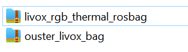

**Build using docker**

- Build docker form Dockerfile.

  ```shell
  cd path_to_your_lvt2calib_ws
  cd src/lvt2calib/docker
  sudo bash build.sh
  sudo bash priv_run.sh
  ```

- Or just pull our image from dockerhub.

  ```shell
  docker pull clothooo/lvt2calib:noetic
  # or
  sudo bash pull_run.sh
  ```

Note: If you use this repo in docker, please **launch your roscore in your local server** at first.

#### 2.2 Preparing the calibration board

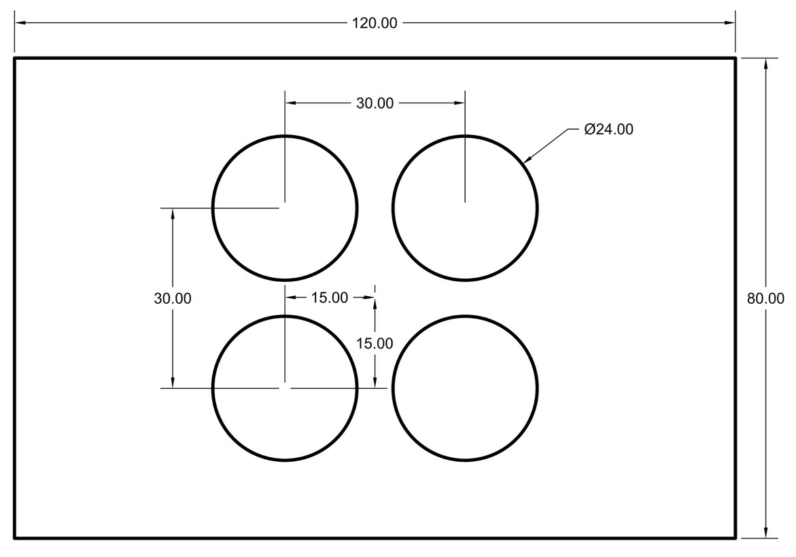

We use a four-circle plate which has the same size as the plate in our previous work[[1]](https://ieeexplore.ieee.org/document/8961462) (also inspired by Guindel's work[[2]](https://ieeexplore.ieee.org.remotexs.ntu.edu.sg/document/8317829)). It is made by acrylic. Then, the back of the board is attached with the same size heating silicone pad to facilitate thermal imaging.

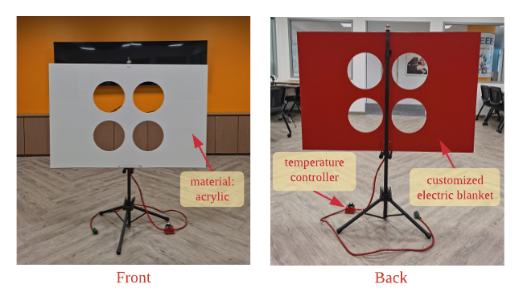

In order to ensure a smooth and successful calibration, the following matters need to be noted:

1. It will be better to select a relatively empty environment without obvious reflection on the ground for the calibration scene;
2. There should not be obvious reflection on the ground (to avoid interference of reflection in the view of the thermal camera);
3. The heating temperature of the calibration plate should not be too high to prevent deformation, but also to have a certain gap with the ambient temperature;
4. The calibration board should be placed on a supporter, which should be as stable as possible during the calibration process;
5. The distance from the thermal camera to the calibration board should be <= 6m (considering the image clarity of the thermal camera).

### Step3: Calibration

#### 3.0 Camera Parameter Setting

(If cameras used)

The camera parameter should be saved as `xxx.txt` in folder `(lvt2calib path)/data/camera_info`. The file should be in the format as:

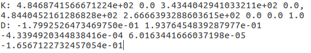

#### 3.1 Quick Start (inavailable for docker, refer to full usage)

Run

```shell
roscd lvt2calib/launch/
bash start_up.bash
```

1. LiDAR-Camera Calibration:

   - If the calibration board use is **dark** (default as white), please run

     ```shell
     bash start_up.bash --darkBoard
     ```

   - If the **compressed** image topic is used, please run

     ```shell
     bash start_up.bash --compressedImg
     ```

   - Of course, these two parameters can be used at the same time (no order is required), like:

     ```shell
     bash start_up.bash --compressedImg --darkBoard
     ```

   The terminal feedback:

   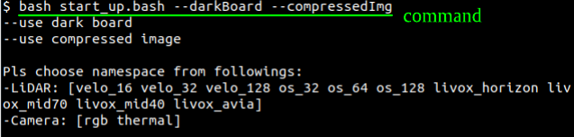

   According to the prompts, enter topic and namespace of the two sensors. <u>Noted: Each sensor corresponds to a specific namespace, please refer to the table in *Appendix* for details.</u> Take the *Livox Horizon* and *RGB camera* as an example:

   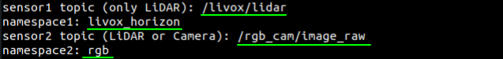

   The type of sensor used is then displayed in the terminal. If it is judged to be a LiDAR-Camera suite, it will continue to prompt for <u>the full path of the camera parameter file (set in *Step 3.0*)</u>.

   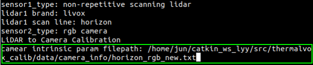

2. LiDAR-LiDAR Calibration:

   Using Livox Mid-70 and Ouster OS1-32 suite as an example, the terminal feedback should be:

   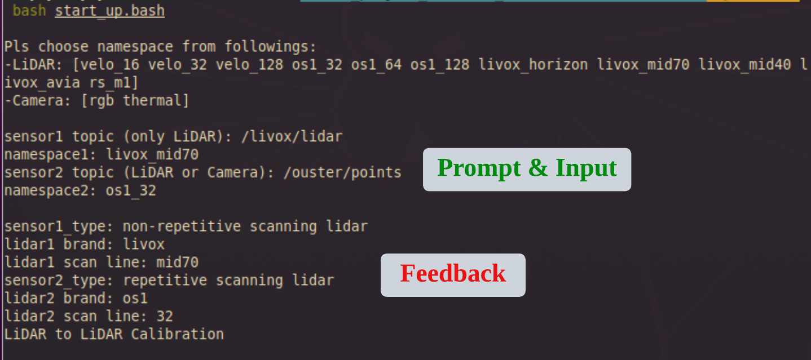
   
   **Noted**: If <u>two sensors of the same type</u> are used, that is, the input namespace are the same, for example, two Livox Horizon LiDARs (livox_horizon), just use the same namespace `livox_horizon`. The program will automatically determine, and <u>add suffixes</u> `_1`and `_2` respectively. This may affect users viewing feature extraction results in *Rviz*, requiring manual changed to the observed topic.

Name the current terminal as T0. Upon entering the command and pressing 'Enter,' three new terminals will appear: T1, T2, and T3.

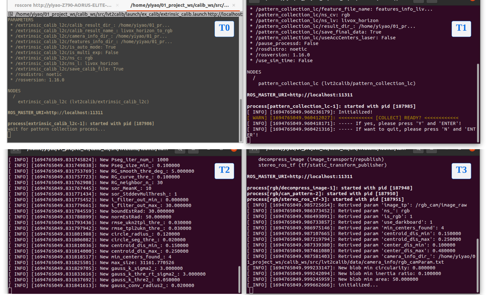

- T0: At this point, it will enter the calibration process and pause, waiting for the completion of the feature collection process.
- T1: Feature Collection Window. Provide feedback on the progress of feature collection from the two sensors and for interactive control.
- T2 & T3: Pattern Detection Windows. Providing feedback on calibration board detection and feature extraction results from the two sensors, respectively.

<u>Continue with the following steps....</u>

#### 3.2 Feature Extraction

***This step is crucial for accurate feature extraction and obtaining precise extrinsic parameters.**

1. For Camera

   Three/Four image windows will pop up: the raw image, the undistorted image, the grayed image (only for rgb cameras) and the result image of circle-center-detection. **Please confirm the successful detection of the circle center features through the result image and terminal T2/T3.**

   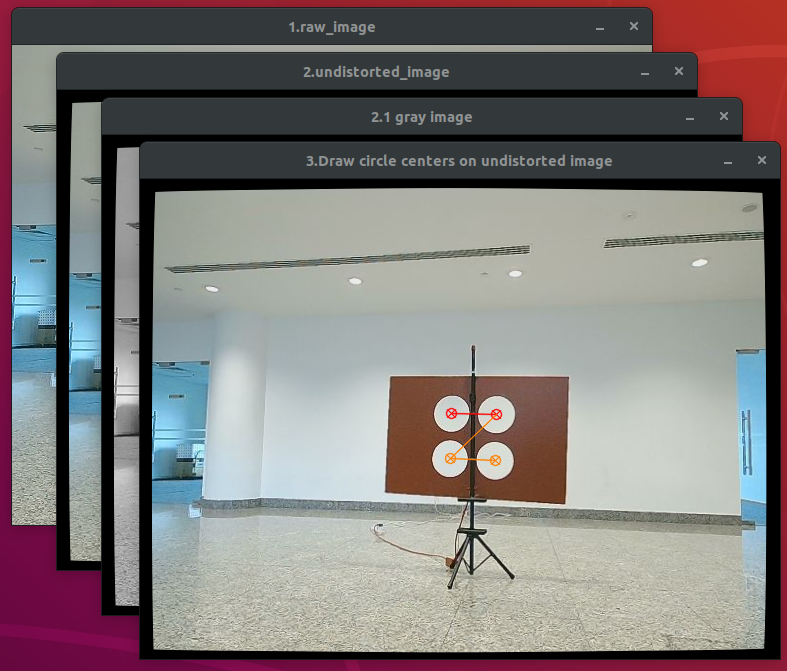

2. For LiDAR

   Note: Pass-through filter can be used in ahead to reduce the operand of point cloud. But please **ensure the background wall of the calibration board is retained in the input point cloud**. Here is and example of input point cloud from OS1-32 LiDAR.

   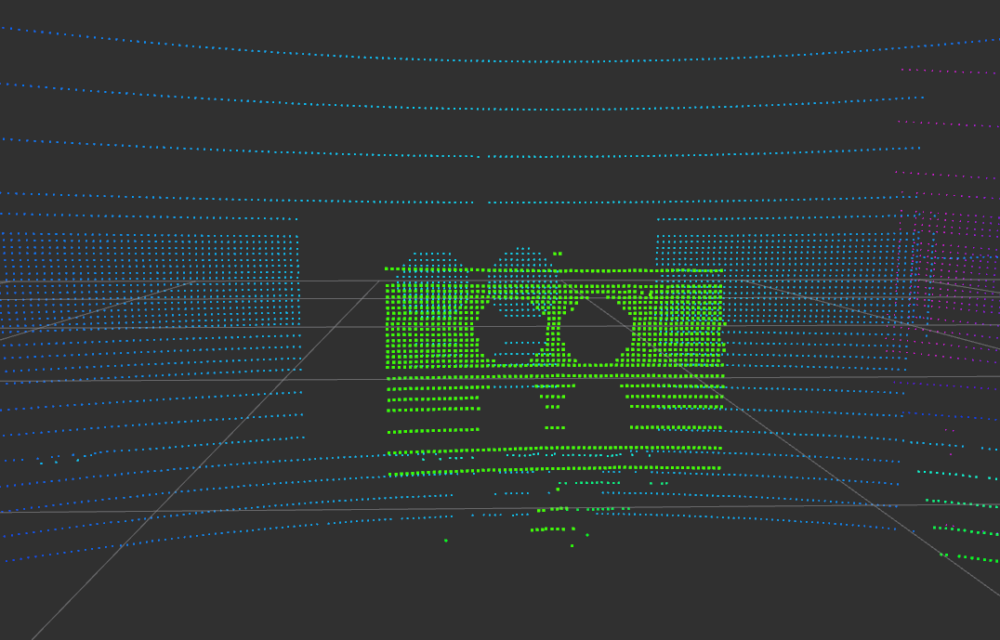

   Focus on the Rviz window. **Ensure you see the correct calibration board point cloud** on the topic `/(ns_lidar)/laser_pattern/calib_board_cloud`, as shown in the figures: the left one from `/livox_mid70/laser_pattern/calib_board_cloud` and the right one from `/os1_32/laser_patter/calib_board_cloud`. **Prompts will also appear in terminal T2/T3**.

   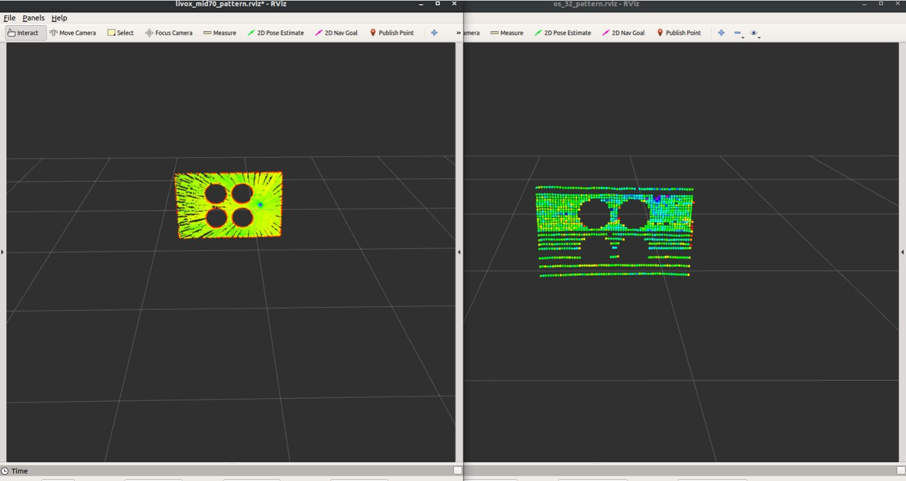

***If any issues at this stage, like the camera not detection the four-hole pattern or the LiDAR not recongnizing the carlibtion board, please check the [HELP.md](./HELP.md) for solutions.**

<u>Continue with the following steps....</u>

#### 3.3 Feature Data Collection

1. Focus on terminal T1. The program will ask if you are ready to collect feature data. **Simply type 'y'/'Y' and press 'Enter', and the feature collection will start**.

   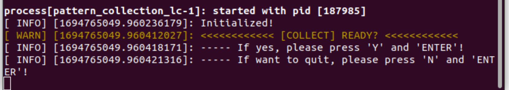

2. Point cloud of four-circle-centers detected by LiDAR will be shown in rviz (topic: `/(ns_lidar)/laser_pattern_circle/circle_center_cloud`)

   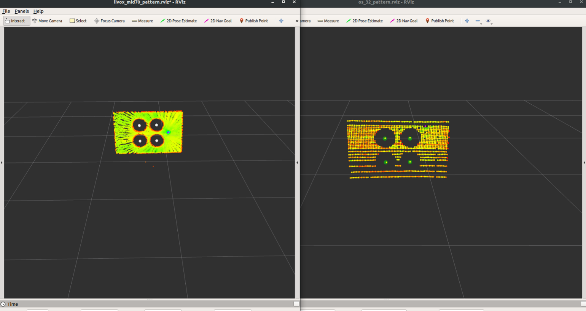

3. In terminal T1, real-time feedback on how many frames of feature data have been collected by each of the two sensors will be provided.

   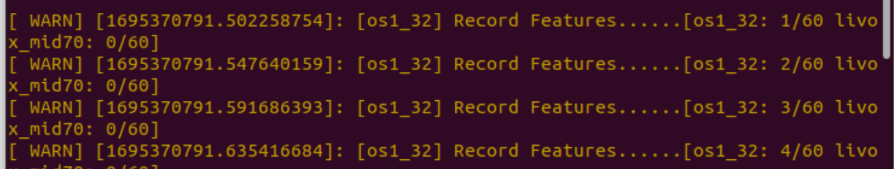

4. Once the predetermined number of features has been collected, the **T1 program will pause and ask if you wish to gather data for the next position**.

   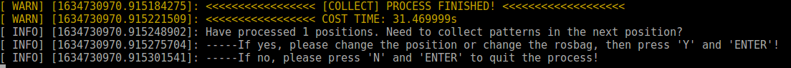

   - If yes, **input 'y'/'Y' followed by 'Enter'. The program will return to the 'READY' interface in step 3.3.1**. You can then adjust the calibration board's position and proceed with a **new round of feature data collection from step 3.2**. (Our paper suggests 9 positions or more)
   - If no, input 'n'/'N' followed by 'Enter' (Note: Please do not directly key *ctrl+c*). The feature detection and collection programs will end while the extrinsic parameter calculation starts (continue to step 3.4).

​	***If the collection takes to long, refer to [HELP.md](./HELP.md) to adjust the preset accumulation frame number.**

#### 3.4 Extrinsic Parameter Calculation

Come back to terminal T0 (running start_up.bash), you will see the extrinsic parameter calculation progress, including the number of feature positions used, the regressed extrinsic matrix, 2D re-projection error (only for camera-related calibration), and 3D matching error. The extrinsic parameters are saved in CSV files:

- LiDAR-LiDAR suite:
  - `(ns_lidar1)_to_(ns_lidar2)_exParam.csv`: the extrinsic parameters from Sensor1 to Sensor2;
  - `L2L_CalibLog.csv`: the log file of each extrinsic parameter calculation result and errors


- LiDAR-Camera suite:

  - `(ns_lidar)_to_(ns_camera)_exParam_min3d.csv`: extrinsic parameters from LiDAR to Camera calculated by minimizing 3d matching error;
  - `(ns_lidar)_to_(ns_camera)_exParam_min2d.csv`: extrinsic parameters from LiDAR to Camera calculated by minimizing 2d re-projection error;

  - `L2C_CalibLog.csv`: the log file of each extrinsic parameter calculation result and errors;

### Step4: Full Usage

1. Feature extraction in LiDAR point cloud

   ```shell
   roslaunch lvt2calib (ns_lidar)_pattern.launch cloud_tp:=(your_lidar_tp) ns_:=(ns_lidar)
   ```

2. Feature extraction in camera image

   ```
   roslaunch lvt2calib (ns_camera)_pattern.launch image_tp:=(your_img_yp) ifCompressed:=(true or false) isDarkBoard:=(true or false) ns_:=(ns_camera) cam_info_dir:=(your_camera_param_filepath)
   ```

   The default value of 'cam_info_dir' is `$(find lvt2calib)/data/camera_info/intrinsic.txt`

3. Feature collection

   ```shell
   # for lidar-lidar calibration
   roslaunch lvt2calib pattern_collection_ll.luanch ns_l1:=(ns_lidar_1) ns_l2:=(ns_lidar_2)
   # for lidar_camera calibration
   roslaunch lvt2calib pattern_collection_lc.launch ns_l:=(ns_lidar) ns_c:=(ns_camera)
   ```

4. Extrinsic Parameter Calculation

   ```shell
   # for lidar-lidar calibration
   roslaunch lvt2calib extrinsic_calib_ll.luanch ns_l1:=(ns_lidar_1) ns_l2:=(ns_lidar_2)
   # for lidar_camera calibration
   roslaunch lvt2calib extrinsic_calib_lc.launch ns_l:=(ns_lidar) ns_c:=(ns_camera)
   ```

## Thanks

[1] J. Zhang, R. Zhang, Y. Yue, C. Yang, M. Wen, and D. Wang, “Slat-calib: Extrinsic calibration between a sparse 3d lidar and a limited-fov low-resolution thermal camera,” in *2019 IEEE International Conference on Robotics and Biomimetics (ROBIO)*, pp. 648–653, 2019.

[2] C. Guindel, J. Beltrán, D. Martín, and F. García, “Automatic extrinsic calibration for lidar-stereo vehicle sensor setups,” in *2017 IEEE 20th International Conference on Intelligent Transportation Systems (ITSC)*, pp. 1–6, Oct 2017.


## Appendix

#### I. Table of arguments corresponding to sensors

| No.  |      Sensor      | Type | Namespace (`ns`) | Feature extraction .launch file |
| :--: | :--------------: | :--: | :--------------: | :-----------------------------: |
|  1   |  Livox Horizon   | NRL  |  livox_horizon   |  livox_horizon_pattern.launch   |
|  2   |   Livox Mid 70   | NRL  |   livox_mid70    |   livox_mid70_pattern.launch    |
|  3   |   Livox Mid 40   | NRL  |   livox_mid40    |   livox_mid40_pattern.launch    |
|  4   |    Livox Avia    | NRL  |    livox_avia    |    livox_avia_pattern.launch    |
|  5   |   Robosense M1   | NRL  |      rs_m1       |   robosense_m1_pattern.launch   |
|  6   | Velodyne VLP-16  | RL_S |     velo_16      |  livox_velo_16_pattern.launch   |
|  7   | Velodyne VLP-32  | RL_S |     velo_32      |  livox_velo_32_pattern.launch   |
|  8   | Velodyne VLP-64  | RL_D |     velo_64      |  livox_velo_64_pattern.launch   |
|  9   | Velodyne VLP-128 | RL_D |     velo_128     |  livox_velo_128_pattern.launch  |
|  10  |  Ouster OS1-32   | RL_D |      os1_32      |      os1_32_pattern.launch      |
|  11  |  Ouster OS1-64   | RL_D |      os1_64      |      os1_64_pattern.launch      |
|  12  |  Ouster OS1-128  | RL_D |     os1_128      |     os1_128_pattern.launch      |
|  13  |    RGB Camera    |  VC  |       rgb        |     rgb_cam_pattern.launch      |
|  14  |  Thermal Camera  |  TC  |     thermal      |   thermal_cam_pattern.launch    |

NRL: Non-repetitive Scanning LiDAR

RL_S: Sparse Repetitive Scanning LiDAR

RL_D: Dense Repetitive Scanning LiDAR

VC: Visual Camera

TC: Thermal Camera

#### II. Parameter Description for Nodes

Please refer to [HELP.md](./HELP.md).

#### III. Paper

[L2V2T2Calib: Automatic and Unified Extrinsic Calibration Toolbox for Different 3D LiDAR, Visual Camera and Thermal Camera (IEEE Xplore)](https://ieeexplore.ieee.org/document/10186657)

[L2V2T2Calib: Automatic and Unified Extrinsic Calibration Toolbox for Different 3D LiDAR, Visual Camera and Thermal Camera (ResearchGate)](https://www.researchgate.net/publication/371377845_L2V2T2Calib_Automatic_and_Unified_Extrinsic_Calibration_Toolbox_for_Different_3D_LiDAR_Visual_Camera_and_Thermal_Camera)


## Citation

If you find this work useful for your research, please consider citing:
```
@INPROCEEDINGS{ZhangLiu2023IV,
  author={Zhang, Jun and Liu, Yiyao and Wen, Mingxing and Yue, Yufeng and Zhang, Haoyuan and Wang, Danwei},
  booktitle={2023 IEEE Intelligent Vehicles Symposium (IV)}, 
  title={L2V2T2Calib: Automatic and Unified Extrinsic Calibration Toolbox for Different 3D LiDAR, Visual Camera and Thermal Camera}, 
  year={2023},
  volume={},
  number={},
  pages={1-7},
  doi={10.1109/IV55152.2023.10186657}}
```
